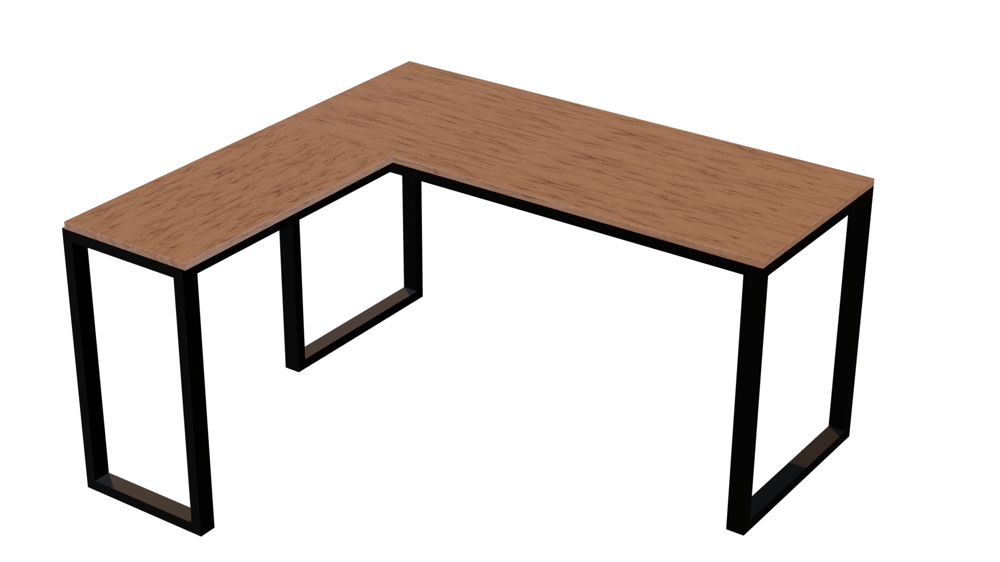
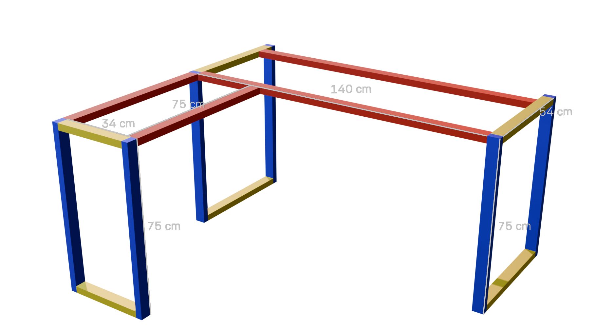
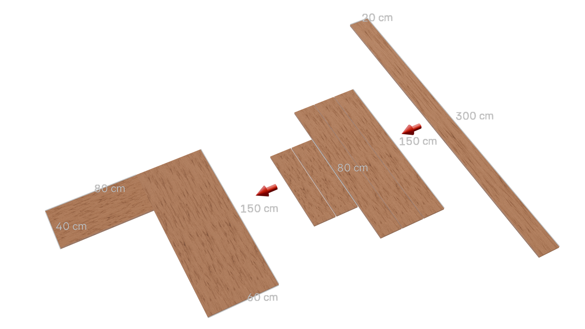

# Mesa Industrial no Formato L

Este repositório apresenta um projeto completo de uma mesa em formato L com estilo industrial, desenvolvida para uso em escritórios ou setups. A estrutura é construída em tubo metalon e o tampo utiliza madeira de pinus. O projeto inclui detalhes de materiais, medidas e sugestões de montagem.

## Sumário

- [Arquivos do Projeto 3D](#arquivos-do-projeto-3d)
- [Materiais Necessários](#materiais-necessários)
- [Orçamento Estimado](#orcamento-estimado)
- [Construir ou Comprar?](#construir-ou-comprar)
- [Medidas](#medidas)
  - [Estrutura de Metalon](#estrutura-de-metalon)
  - [Medidas do Tampo de Madeira](#medidas-do-tampo-de-madeira)
- [Passo a Passo de Montagem](#passo-a-passo-de-montagem)
- [Imagens do Projeto Realizado](#imagens-do-projeto-realizado)

## Arquivos do Projeto 3D

O modelo 3D da mesa foi criado no Blender e está disponível para download abaixo. Você pode usá-lo para visualizar a montagem, fazer alterações ou gerar novos renders.

Clique [aqui](Arquivo%20blender) para baixar o arquivo .blend.

## Materiais Necessários

### Estrutura

- 12 metros de tubo metalon 50x30 mm ou 40x30 mm
- Lixa para ferro (grão nº 120 ou 150)
- Primer (fundo preparador)
- Tinta spray preta fosca ou brilhante

> Para quem busca economia, o tubo 40x30 mm é suficiente.  
> Para mais resistência, especialmente para um uso intenso, recomenda-se o 50x30 mm.  
> Uma alternativa viável é usar 6 metros de cada modelo, aplicando o mais espesso nas áreas críticas da estrutura.

### Tampo

- 3 tábuas de madeira de pinus com medidas: 3 m × 20 cm × 2 cm  
> No projeto foi utilizada madeira de pinus, a qual é vendida na minha região com as medidas acima. Outra possibilidade é usar uma porta, MDF ou MDP com acabamento laminado. A escolha depende do seu orçamento e da estética desejada.
- Cola de madeira
- Lixa de madeira (grão médio e fino)
- Verniz

### Materiais Secundários

Estes itens variam conforme o método de montagem, acabamento e ferramentas disponíveis.  
Eles não foram incluídos no cálculo de materiais, pois seus preços variam, são opcionais, ou já estão inclusos na mão de obra contratada.

- Eletrodos para solda
- Parafusos e buchas
- Pregos
- Pés de borracha, silicone ou metal (opcional)
- Selador ou fundo preparador

## Orcamento Estimado

Os valores apresentados abaixo são referenciais e se baseiam na minha experiência pessoal com a construção do projeto.  
Importante: o orçamento pode variar significativamente de região para região, devido a diferenças nos preços de materiais, mão de obra e transporte.  
Portanto, não deve ser utilizado como base direta de comparação ou orçamentos profissionais.

| Categoria                  | Descrição                          | Valor (R$) |
|---------------------------|------------------------------------|------------|
| Estrutura metálica        | Tubos de metalon (12 metros)       | R$ 190,00  |
| Tampo de madeira          | 3 tábuas de pinus (3m x 20cm x 2cm)| R$ 60,00   |
| Mão de obra e transporte  | Solda, montagem e entrega          | R$ 100,00  |
| Materiais diversos        | Lixas, verniz, parafusos, tinta etc.| R$ 75,00  |
|                           | Total aproximado                   | R$ 425,00  |

> Os valores são aproximados e podem ser reduzidos caso você já tenha ferramentas ou materiais disponíveis, ou se optar por fazer parte da montagem por conta própria.

## Construir ou Comprar?

Ao analisar o preço, talvez você esteja repensando se vale mesmo a pena construir uma mesa, afinal, é possível encontrar modelos semelhantes prontos na Amazon ou Mercado Livre.

No entanto, se você busca algo realmente resistente, durável e sob medida para o seu espaço, a construção própria se destaca. Ao fabricar, você tem controle total sobre:
- Qualidade dos materiais
- Personalização das medidas, encaixando perfeitamente no seu ambiente
- Estilo e acabamento conforme seu gosto
- Custo-benefício a longo prazo, já que estruturas feitas com metalon e pinus tratada tendem a durar muitos anos, mesmo sob uso intenso

Além disso, construir pode ser uma experiência gratificante, especialmente se você gosta de projetos manuais ou quer algo único.

## Medidas

As medidas deste projeto foram pensadas para oferecer um bom espaço de trabalho. Caso ache a mesa grande, você pode ajustá-las conforme o espaço disponível ou o material que tiver à disposição.

Além disso, o projeto é facilmente modificável. Se desejar, é possível transformá-lo em um modelo reto e simples, bastando remover a parte menor do “L” e reorganizar a estrutura.

### Estrutura de Metalon

| Cor       | Código | Descrição                                      | Quantidade | Medidas (cm)                  |
|-----------|--------|------------------------------------------------|------------|-------------------------------|
| Vermelho  | S      | Suportes superiores horizontais (topo)         | 4          | 2 barras de 140 cm e 2 de 75  |
| Azul      | P      | Pés verticais da estrutura                     | 6          | 6 barras de 75 cm             |
| Amarelo   | E      | Travessas de conexão                            | 6          | 4 barras de 54 cm, 2 de 34 cm |

> Nota: As barras do tipo S sustentam o tampo da mesa. Os pés (P) são os apoios verticais principais. As travessas E conectam os pés e garantem estabilidade.  
> Uma das barras vermelhas foi propositalmente recuada para deixar um espaço livre atrás da mesa, ideal para instalação de suportes com pressão, como braços de monitor.

### Medidas do Tampo de Madeira

Distribuição das tábuas de pinus para formar o tampo em formato L.

| Peça            | Quantidade | Medidas (cm) | Observações                                   |
|-----------------|------------|--------------|-----------------------------------------------|
| Tábua inteira   | 3          | 300 x 20 x 2 | Tábua original, será cortada                  |
| Parte maior     | 3          | 150 x 20     | Lado principal da mesa (150 x 60 com 3 peças) |
| Parte menor     | 2          | 80 x 20      | Lado menor da mesa                            |

> Nota: As sobras da madeira podem ser usadas para reforçar a junção entre tábuas.

## Passo a Passo de Montagem

### Estrutura de Metalon

1. Corte os tubos conforme as medidas da tabela (S, P, E).
2. Posicione tudo no chão em formato L para visualizar.
3. Faça pontos de solda nas junções.
4. Confirme o esquadro e finalize a soldagem.
5. Lixe as partes soldadas e aplique primer.
6. Após secar, pinte com spray preto.

### Tampo de Madeira

1. Corte as tábuas com 3 metros nas medidas necessárias.
2. Una as peças com cola de madeira, parafusos e suportes por baixo.
3. Lixe todas as superfícies (grão médio e depois fino).
4. Aplique 2 a 3 demãos de verniz (transparente, imbuia ou mogno).

### Montagem Final

1. Posicione o tampo sobre a estrutura já pintada.
2. Parafuse por baixo com parafusos de madeira ou grampos.
3. Adicione pés de borracha ou niveladores, se desejar.

## Imagens do Projeto Realizado

Este projeto ainda está em produção. As imagens reais da montagem e da mesa pronta serão adicionadas em breve nesta seção.
